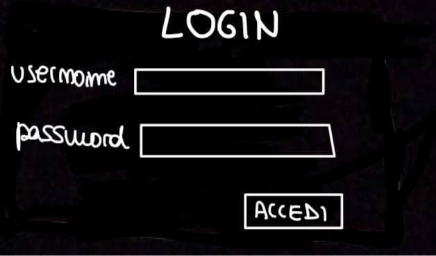
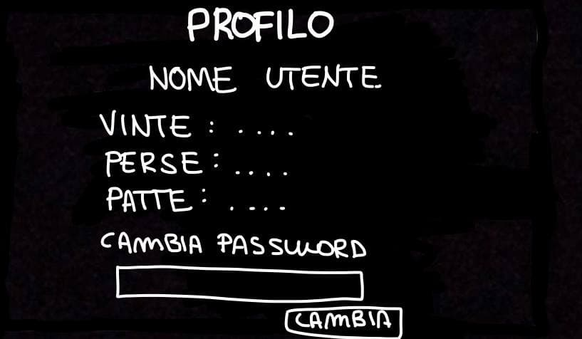
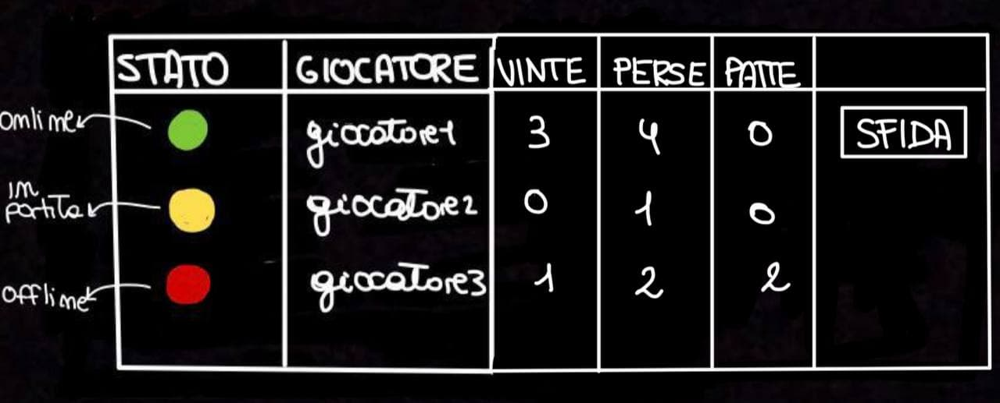
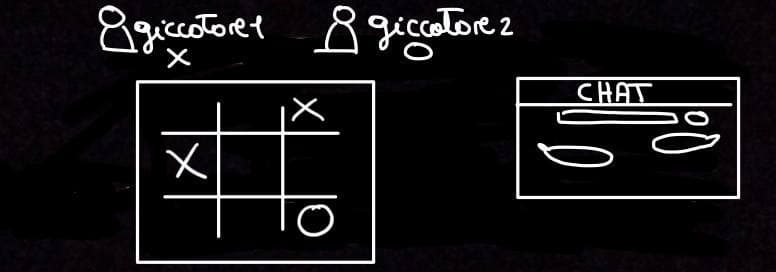
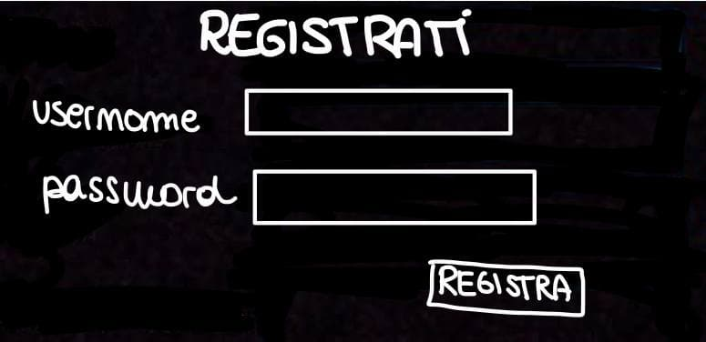

>*Linguaggi e tecnologie per il web (Prof: Riccardo Rosati, tutor: Lorenzo Marconi) 
>D'Amico Martina, Dito Andrea*

<h1>Documentazione progetto</h1>

## Specifiche

Si vuole realizzare un'applicazione che consenta a due o più utenti di giocare al gioco del tic tac toe (tris). Di ogni utente è necessario conoscere l'username, la sua password.

L'utente una volta registrato può giocare una partita selezionando uno degli utenti online, i quali possono essere: *online*, *offline* oppure *in partita*, solo ai giocatori online è possibile inviare una proposta di sfida.

Di ogni partita interessa sapere se la partite è in corso, iniziata o terminata, chi gioca con X e chi con O, in particolare l'applicazione sceglierà randomicamente il simbolo.
Il giocatore a cui è stato assegnato X fa la prima mossa.

Nella schermata di gioco viene registrato il punteggio dei due giocatori.

Se la partita è:
 * **in corso** interessa sapere a chi tocca la mossa successiva e registrare le mosse con il relativo ordine.
 * **terminata** interessa sapere il risultato della partita (1: vince X, 2: vince O, 3: patta).

Del giocatore interessa sapere il numero di partite: *perse*, *vinte* e *pareggiate*

Una volta terminata la partita l'utente può:

 * tornare nella schemata precedente e scegliere un nuovo avversario
 * fare logout e uscire dall'applicazione

## Lato client (Front-end)
### 1-Schermata di login
Vi si accede non appena si entra nell'applicazione o cliccando il pulsante di logout dalla schermata di scelta dello sfidante.
Ha due campi compilabili (*username* e *password*) e due bottoni da poter cliccare (*login* e *signin*). Cliccando su *login* si accede alla schermata di scelta dello sfidante. Cliccando su *signin* si accede alla schermata di registrazione.

### 2-Schermata di registrazione
Vi si accede cliccando su sign-in nella schermata di login
Ha 2 campi compilabili (username e password).
Registrati porta alla schermata di login.

### 3-Schermata di scelta dello sfidante
Vi è una tabella contenente tutti i giocatori registrati. In particolare un giocatore può giocare con un altro utente a patto che questo sia online e non offline o in partita.
Il pulsante di sfida porta alla schermata di gioco (una volta cliccato fará comparire un popup con scritto “Giocatore x ti ha proposto una sfida!”. Fará invece comparire “Sfidato da...” al posto del pulsante sfida nella schermata del giocatore).
La tabella può essere ordinata a seconda che si premano i pulsanti Stato, Giocatore, Vinte, Perse, Patte

### 4-Schermata di gioco
Vi si accede cliccando il pulsante sfida da Schermata di scelta dello sfidante.
A partita terminata compare un popup con scritto il vincitore della partita.

Vi sono in particolare la tabella di gioco (tris) e una chat per poter scambiare dei messaggi con l'avversario

### 5-Schermata di profilo
Vi si accede cliccando profilo dalla schermata di scelta dello sfidante.
Mostra le informazioni sull’utente, permettendone la modifica della password.

